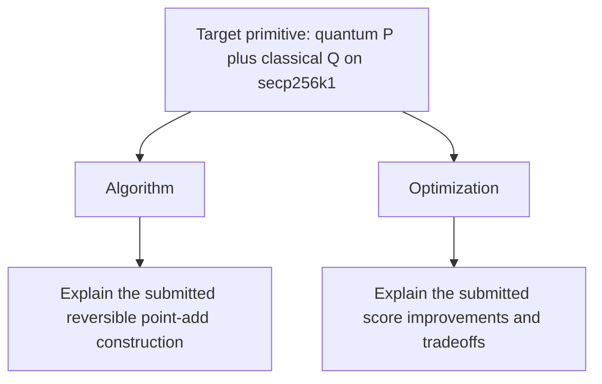

# secp256k1 Point-Addition Circuit Contest

Build the lowest-score reversible circuit for adding a quantum secp256k1 point
to a classical secp256k1 point. Lower scores mean fewer live logical qubits and
fewer executed non-Clifford resources in a core elliptic-curve operation. This
contest verifies submissions with 102,400 shots and server-side seed to avoid
GPU grinding/over-fitting. This contest is inspired by the [ecdsa.fail](https://ecdsa.fail) contest and its community.

## Goal

Optimize mixed affine point addition `P <- P + Q`, where `P` is quantum and `Q`
is classical, under the `balanced-qubit-toffoli-depth-v1` score:

```text
peak logical qubits * sqrt(
  round(average executed CCX + CCZ)
  * round(average executed Toffoli depth)
)
```

Lower is better.

## Quick start

```bash
./ecdlp.js setup
./ecdlp.js preflight
./ecdlp.js run --note "describe the candidate"
```

To install a contest-specific launcher without replacing another ECDLP contest's
CLI, run `./install.sh`; it installs `ecdlp-point-add` by default.

AI coding agents and autoresearch sessions must also read
[`AGENTS.md`](AGENTS.md) before changing contestant code. Resume any existing
local research state under `.workspace/autoresearch/` rather than recreating it.
Run builds from this repository or a repository-local isolated worktree, and
keep `CARGO_TARGET_DIR` inside the checkout; see the
[repository-local build rule](AGENTS.md#repository-local-build-rule), especially
on Windows.

## Benchmark contract

| Item | Contract |
| --- | --- |
| Contest-server track | `point-add-secp256k1-v1` |
| Score model | `balanced-qubit-toffoli-depth-v1` |
| Direction | Lower is better |
| Contestant-editable path | `src/point_add/` |
| Validation gate | 102,400 Fiat-Shamir shots in 100 waves of 1,024 |

The repository follows the ECDSA Fail trust boundary:

- contestant code under `src/point_add/` is untrusted;
- `build_circuit` is an untrusted build stage that emits `ops.bin` from
  contestant code;
- trusted `eval_circuit` never imports contestant code and validates the emitted
  circuit;
- `ecdlp package` archives only the manifest's `editablePaths`;
- the contest worker overlays that archive on a clean baseline and ranks only a
  reproduced passing result.

### Circuit ABI

The circuit exposes four 256-wire registers:

| Register | Wire type | Contract |
| --- | --- | --- |
| 0: `target_x` | qubit | affine input `P.x`, overwritten with `(P + Q).x` |
| 1: `target_y` | qubit | affine input `P.y`, overwritten with `(P + Q).y` |
| 2: `offset_x` | classical bit | affine input `Q.x`, preserved |
| 3: `offset_y` | classical bit | affine input `Q.y`, preserved |

The curve is `y^2 = x^3 + 7 mod p`, where:

```text
p = 0xfffffffffffffffffffffffffffffffffffffffffffffffffffffffefffffc2f
```

The deterministic generator excludes infinity and same-x exceptional cases.

### What valid means

A run is rejected if any of these checks fails:

- classical correctness on all 102,400 shots;
- preservation of the classical offset registers;
- reversibility and cleanup of every freed workspace qubit;
- phase cleanliness;
- forward/reverse identity.

### Validation security

The 102,400-shot gate acknowledges
[Craig Gidney's critique](https://x.com/CraigGidney/status/2088847417022034364?s=20)
that sparse circuit errors can evade low-shot testing and that retry cost should
be reflected in resource estimates; Gidney proposed 10 million shots with
retry-rate-aware scoring. We use 102,400 shots—100 evenly batched waves of
1,024—as a substantially stricter but still routine per-submission gate. Shot
count alone would remain grindable with a public deterministic seed, so the
trusted worker first reproduces and checks the submitted `ops.bin` commitment,
then draws a fresh private seed, uses it only in the trusted evaluator for
validation inputs and measurement randomness, and publishes
it after acceptance for exact replay. This makes the checked cases
unpredictable while preserving deterministic local development and reproducible
accepted results. See [`docs/VALIDATION.md`](docs/VALIDATION.md) for the full
threat model and replay protocol.

## Reference baseline

The correctness-first parent baseline is an affine point-add circuit adapted from
public ECDSA Fail commit
`da90a484510cf223b525ea84b3f2da9bccd6f8b3`. It uses two conservative
Kaliski inverse/apply pairs with the full `2 * 256 - 1 = 511` schedule and
explicit computation, scaling, cleanup, and uncomputation. It has no identity
tail, nonce, or seed-grinding parameter.

| Metric | Baseline |
| --- | ---: |
| Validation | 102,400/102,400; zero classical, phase, and ancilla failures |
| Average executed CCX+CCZ | 5,180,786.000 |
| Average executed Toffoli depth | 5,180,786 |
| Peak logical qubits | 2,841 |
| Emitted operations | 40,922,100 |
| Score | 14,718,613,026 |
| `ops.bin` SHA-256 | `962f5c2c1e7a8f3fe4c65230af910e638870d914c50452ef71c7fa197e9e51a5` |

The detailed reversible schedule is in
[`src/point_add/memory/NONCE_FREE_POINT_ADD_BLOCKS.md`](src/point_add/memory/NONCE_FREE_POINT_ADD_BLOCKS.md).
The current candidate's public evidence and submission history are in
[`src/point_add/SUBMISSION.md`](src/point_add/SUBMISSION.md).

## secp256k1 point-addition qubit and score comparison

This table compares public ECDSA.fail submissions, published circuit estimates,
and challenge baselines in ascending peak-logical-qubit order. The submission
ladder uses the earliest accepted result at each distinct qubit count; external
figures are cited in their rows. Scores are qubits multiplied by rounded
Toffoli count when no separate depth measurement is available. The final column
reports current 102,400-shot, commitment-only validation without an external
seed, or states why that replay is unavailable.

| Commit | Solver | Qubits | Toffoli | Score | 102,400-shot classical/phase/ancilla |
| --- | --- | ---: | ---: | ---: | ---: |
| [`3493c837`](https://github.com/Layr-Labs/ecdsafail-challenge/commit/31f9c58ce9c5a12df8d18245f3905cc3352cb6a9) | jackylee0424 | 1,150 | 1,284,776 | 1,477,492,400 | 264/173/0 |
| [`6c0e30c6`](https://github.com/Layr-Labs/ecdsafail-challenge/commit/3222da606dc1ccf9435cb6d382c11e58a34557f4) | Gajesh2007 | 1,151 | 1,301,798 | 1,498,369,498 | 142/119/0 |
| [`71f51157`](https://github.com/Layr-Labs/ecdsafail-challenge/commit/d44cad386f2e121e2d952edcdcc3693f97d13153) | BitWonka | 1,152 | 1,364,230 | 1,571,592,960 | 227/163/0 |
| [`5fc2e81c`](https://github.com/Layr-Labs/ecdsafail-challenge/commit/da51a4807f92e4dd6df60262a9258aa751adbb58) | jieyilong | 1,153 | 1,368,487 | 1,577,865,511 | 205/151/0 |
| [`8233cd7e`](https://github.com/Layr-Labs/ecdsafail-challenge/commit/d9ef3e950e0a9151daa81278770bc9bdb4a73537) | gopikannappan | 1,154 | 1,294,287 | 1,493,607,198 | 162/108/0 |
| [`66503c19`](https://github.com/Layr-Labs/ecdsafail-challenge/commit/cde752dffd45a197142395b3c52b5058e0a83f73) | BitWonka | 1,156 | 1,381,234 | 1,596,706,504 | 180/104/0 |
| [`d78c89d1`](https://github.com/Layr-Labs/ecdsafail-challenge/commit/6ba606a20780ed84a47c62250a4630bc43f759f7) | jieyilong | 1,157 | 1,380,890 | 1,597,689,730 | 169/99/0 |
| [`a536a487`](https://github.com/Layr-Labs/ecdsafail-challenge/commit/f5ff95b26059e0d01b143e67bf93cad2649a3668) | Gajesh2007 | 1,158 | 1,292,651 | 1,496,889,858 | 147/130/0 |
| [`6c1a65d4`](https://github.com/Layr-Labs/ecdsafail-challenge/commit/fed64cf6ec83e31d97af62886f842322d8d18860) | nasqret | 1,159 | 1,388,180 | 1,608,900,620 | 156/110/0 |
| [`f5c7775d`](https://github.com/Layr-Labs/ecdsafail-challenge/commit/31421df3c45cadd54e671454aeda32a53122d71a) | jieyilong | 1,162 | 1,391,406 | 1,616,813,772 | 145/100/0 |
| [`175749f7`](https://github.com/Layr-Labs/ecdsafail-challenge/commit/b310de9821131306fe88b39fa3592743951eb581) | BitWonka | 1,163 | 1,412,402 | 1,642,623,526 | 148/105/0 |
| [`44d7d516`](https://github.com/Layr-Labs/ecdsafail-challenge/commit/f8d23a96c25b839ae7c380ca5dface8c45c1a079) | BitWonka | 1,164 | 1,413,462 | 1,645,269,768 | 97/58/0 |
| [`05c0b965`](https://github.com/Layr-Labs/ecdsafail-challenge/commit/cea9f5fc1f5a20bd5bfa47138aacba95990bab5d) | BitWonka | 1,165 | 1,413,487 | 1,646,712,355 | 112/58/0 |
| [`33392f6b`](https://github.com/Layr-Labs/ecdsafail-challenge/commit/ab1b2d64452887d302180a2f0e421252dd8d0edd) | PhantasticUniverse | 1,166 | 1,422,616 | 1,658,770,256 | 108/64/0 |
| [`af5abb17`](https://github.com/Layr-Labs/ecdsafail-challenge/commit/bdb1d22261e6e5e86dba5f63a8339449430b167a) | tob-joe | 1,167 | 1,422,591 | 1,660,163,697 | 114/61/0 |
| [`77eaef64`](https://github.com/Layr-Labs/ecdsafail-challenge/commit/35ceb019efa0d48accca8176a9382a47219f1ba0) | BitWonka | 1,168 | 1,433,676 | 1,674,533,568 | 217/112/0 |
| [`1278a074`](https://github.com/Layr-Labs/ecdsafail-challenge/commit/674d0d81df048324d6b7f0c971aea12e51e3f0d8) | nasqret | 1,170 | 1,434,999 | 1,678,948,830 | 202/104/0 |
| [Google private low-qubit Pareto point dataset](https://zenodo.org/records/19597130) | [Google Quantum AI](https://arxiv.org/pdf/2603.28846) | 1,175 | 2,700,000 | 3,172,500,000 | not available (private circuit) |
| [`3182d2b3`](https://github.com/Layr-Labs/ecdsafail-challenge/commit/cf310ecb9a0bb938bb961fcd18019e891c5b7d12) | nasqret | 1,185 | 1,418,587 | 1,681,025,595 | 196/102/0 |
| [`a7ec174f`](https://github.com/Layr-Labs/ecdsafail-challenge/commit/0fa5c6f5f79c1cb14f046534c9ba12ab1d81e9fa) | jieyilong | 1,192 | 1,412,425 | 1,683,610,600 | 153/76/0 |
| [`ad4cf86d`](https://github.com/Layr-Labs/ecdsafail-challenge/commit/bb579bba251e2ef0260d605d37600a5ea3770c24) | BitWonka | 1,193 | 1,412,391 | 1,684,982,463 | 197/109/0 |
| [Public space-optimized circuit `9b23c917`](https://gitlab.inria.fr/capsule/qarton-projects/ec-point-addition/-/commit/9b23c9170a636a7097a02afb3a3d6cbb6425c9f4) | [André Schrottenloher](https://arxiv.org/pdf/2606.02235) | 1,195 | 2,304,135 | 2,753,441,325 | not run (public Qarton circuit) |
| [`833642fe`](https://github.com/Layr-Labs/ecdsafail-challenge/commit/6953d1b28a67e931d63ba4c80ed573fca9afc3e5) | BitWonka | 1,203 | 1,410,971 | 1,697,398,113 | 209/116/0 |
| [WarpSpeed `cd2b9c0`](https://github.com/double-ai/double-zkp-ecc/commit/cd2b9c087735602af52e4f9e6bcf575623fe6437) | [doubleAI](https://www.doubleai.com/research/warpspeed-discovers-record-breaking-ecdsa-cracking-circuit) | **1,205** | **993,181** | **1,196,783,105** | not available (private circuit) |
| [`e928607`](https://github.com/Layr-Labs/ecdsafail-challenge/commit/e928607ffd0cf841cd142244f2cfac7d4baae6e1) | benhuang2025 | 1,278 | 943,897 | 1,206,300,366 | 82/53/0 |
| [`be0c8bc`](https://github.com/Layr-Labs/ecdsafail-challenge/commit/be0c8bc3a9df3590805f7fb1cef799da520ef44e) | Akashneelesh | 1,318 | 940,014 | 1,238,938,452 | 87/47/0 |
| [`8cdc0e6`](https://github.com/Layr-Labs/ecdsafail-challenge/commit/8cdc0e6ab8fd101c107be24ae2c4b0a870ebdb1a) | Akashneelesh | 1,320 | 951,299 | 1,255,714,680 | 34/22/0 |
| [`897dda2`](https://github.com/Layr-Labs/ecdsafail-challenge/commit/897dda2b0cf267151ecd973252d2a5078cbf1b63) | teddyjfpender | 1,321 | 952,707 | 1,258,525,947 | 36/24/0 |
| [Google private low-gate Pareto point dataset](https://zenodo.org/records/19597130) | [Google Quantum AI](https://arxiv.org/pdf/2603.28846) | 1,425 | 2,100,000 | 2,992,500,000 | not available (private circuit) |
| [Public gate-optimized circuit `9b23c917`](https://gitlab.inria.fr/capsule/qarton-projects/ec-point-addition/-/commit/9b23c9170a636a7097a02afb3a3d6cbb6425c9f4) | [André Schrottenloher](https://arxiv.org/pdf/2606.02235) | 1,443 | 1,799,437 | 2,596,587,591 | not run (public Qarton circuit) |
| [ECDSA.fail challenge initial baseline `f43a73e8`](https://github.com/Layr-Labs/ecdsafail-challenge/commit/f43a73e871e18238a36889409943d008c2a0c2e9) | ECDSA.fail challenge | 2,715 | 3,942,753 | 10,704,574,395 | 0/5/0 |
| [`2386bab`](https://github.com/ecdlp-contest/ecdlp-point-add/commit/2386bab6db30561e42cd16708c2bd4eb8e211b64) | reference baseline | _2,841_ | _5,180,786_ | _14,718,613,026_ | **0/0/0** |
| [`513bfec`](https://github.com/ecdlp-contest/ecdlp-point-add/commit/513bfec) | current accepted candidate | _2,841_ | _5,180,781_ | _14,718,598,821_ | **0/0/0** |

Every replayed public ECDSA.fail row is invalid under the current validation
gate. The accepted-submission ladder from 1,150 through 1,203 has nonzero
classical and phase failures despite zero ancilla failures; the 2,715-qubit
initial baseline has 0 classical, 5 phase, and 0 ancilla failures. Consequently,
the displayed scores are historical context rather than current canonical
scores. The Google and WarpSpeed rows are external references whose private
operation streams are unavailable for a 102,400-shot replay. WarpSpeed's public
zero-knowledge proof certifies at most 993,181 average executed CCX+CCZ gates
and 1,205 logical qubits over its private circuit's historical 9,024-input test.
The Schrottenloher rows cite public Qarton circuits that have not yet been
adapted to this evaluator. Their reported counts include Toffoli/AND gates, and
their displayed scores are count-based proxies (`qubits × Toffoli`) because the
source does not report average executed Toffoli depth. See
[Schrottenloher](https://arxiv.org/pdf/2606.02235),
[Google Quantum AI et al.](https://arxiv.org/abs/2603.28846v2), the
[DoubleAI article](https://www.doubleai.com/research/warpspeed-discovers-record-breaking-ecdsa-cracking-circuit),
and the [proof repository](https://github.com/double-ai/double-zkp-ecc).

## What you can edit

Contestant changes must stay under:

```text
src/point_add/
```

Every submission must keep its implementation, public submission note, and
architecture diagram synchronized:

```text
src/point_add/mod.rs
src/point_add/SUBMISSION.md
src/point_add/architecture.mmd
src/point_add/memory/
```

The Mermaid architecture diagram must be valid UTF-8, at most 1 MiB, and begin
with `flowchart` or `graph`. It must have exactly one root with the exact target
label below, exactly one `Algorithm` node, and exactly one `Optimization` node:



The target must be the only root and have no incoming edge. Both explanation
branches need at least one child. Add nodes and cross-links for the submitted
algorithm, arithmetic blocks, cleanup, optimizations, metrics, Toffoli depth,
and validation evidence. The note and diagram must report the reviewed score,
qubits, executed Toffolis, Toffoli depth, and 102,400-shot validation evidence;
the note must also report the reviewed `ops.bin` SHA-256.

Do not change these trusted contract files when comparing or submitting
candidates:

```text
src/bin/build_circuit.rs
src/bin/eval_circuit.rs
src/circuit.rs
src/sim.rs
src/weierstrass_elliptic_curve.rs
Cargo.toml
Cargo.lock
rust-toolchain
benchmark.json
```

Packaging commits the diagram path, size, and SHA-256 and verifies the same
diagram inside `submission.tar.gz`.

## Local workflow

Run the checked-in baseline or a candidate:

```bash
./ecdlp.js setup
./ecdlp.js preflight
./ecdlp.js run --note "describe the candidate"
```

Prepare and validate a submission package:

```bash
./ecdlp.js package \
  --note-file src/point_add/SUBMISSION.md \
  --model "model name"
./ecdlp.js validate
```

The final public note, including its `Model:` prefix, must be between 5 KiB and
10 KiB of UTF-8 text. It must contain these non-empty Markdown sections; the
CLI matches their headings case-insensitively by the listed keywords:

1. `AI Model/Harness` (`model` and `harness`): identify the LLM, effort level,
   and harness such as Codex app, Claude app, Claude Code, OpenClaw, or Hermes.
2. `Summary` (`summary`): explain why and how the candidate can beat the prior
   baseline.
3. `Method` (`method`): explain how the submitted implementation works.
4. `Result` (`result` or `results`): report measured results and validation.
`Caveat and what is left`, `Credit`, `References`, and `Comments` sections are
optional. Caveats may document risks, limitations, remaining work, next steps,
or future opportunities. Credit may name a GitHub username and commit link;
references may cite related work; comments may include any additional submitter
context.

The evaluator writes `ops.bin`, `score.json`, and the append-only benchmark
history `results.tsv`; packaging writes under `dist/`. These are generated
artifacts and must not be hand-edited.
`.workspace/` is ignored, machine-local research state and must never be
packaged or submitted.

The trusted evaluator defaults to `ECDLP_EVAL_THREADS=16`. Each worker runs 64
bit-sliced shots, so 102,400 shots form 100 complete waves of 1,024. Separate
artifact-bound SHAKE256 domains derive inputs and measurement randomness, making
results independent of thread scheduling.

## Submit

Authenticate with a contest API key, submit the validated package, and watch the
trusted rerun:

```bash
./ecdlp.js login <api-key>
./ecdlp.js submit --confirm-docs-truthful --watch
```

Pass `--source-url https://github.com/<org>/<repo>/pull/<id>` only when public
source or pull-request context is available for reviewers. The packaged note
and model cannot be overridden at submit time; edit the canonical note, rebuild
the package, and then submit it. Immediately
before upload, `submit` asks the contender agent to inspect the packaged note and
diagram, verbally give the user its truthfulness/relevant-detail verdict, and
rerun with `--confirm-docs-truthful` only when that verdict is yes.

The CLI rejects an equal-or-worse candidate against the current accepted
leaderboard. Server receipt is not promotion: the trusted worker must reproduce
the package on a clean baseline before it becomes ranked.

## Documentation map

- [`README.md`](README.md): canonical benchmark contract and public workflow.
- [`AGENTS.md`](AGENTS.md): local autoresearch, isolation, evidence, and
  retention protocol.
- [`docs/VALIDATION.md`](docs/VALIDATION.md): validation-seed threat model and
  accepted-result replay.
- [`src/point_add/SUBMISSION.md`](src/point_add/SUBMISSION.md): current
  candidate note and trusted evidence.
- [`src/point_add/memory/NONCE_FREE_POINT_ADD_BLOCKS.md`](src/point_add/memory/NONCE_FREE_POINT_ADD_BLOCKS.md):
  detailed baseline block schedule.

## Scope and attribution

This contest optimizes one reversible mixed point-add primitive under the stated
input domain and validation contract. It is not a complete implementation of
Shor's algorithm or a claim of a practical attack on secp256k1.

The public challenge harness and baseline arithmetic come from
[`ecdsafail/ecdsafail-challenge`](https://github.com/ecdsafail/ecdsafail-challenge).
See [`NOTICE`](NOTICE) for the CC BY 4.0 attribution of reused ZKP-ECC files.
