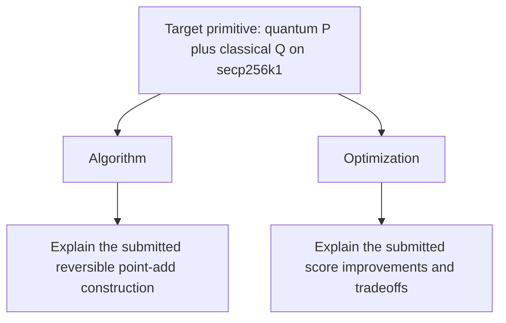

# secp256k1 Point-Addition Circuit Contest

Build the lowest-score reversible circuit for adding a quantum secp256k1 point
to a classical secp256k1 point. The score is:

```text
round(average executed CCX + CCZ) * peak logical qubits
```

Lower is better. The native benchmark name remains `ecadd-challenge-test`; the
`ecdlp-contest` server routes its package to track `point-add-secp256k1-v1`.

This repository follows the ECDSA Fail trust boundary and the
`ecdlp-5-bit-contest` package/CLI workflow:

- contestant code is everything under `src/point_add/`;
- `build_circuit` is untrusted and emits `ops.bin` from contestant code;
- `eval_circuit` is trusted, does not import contestant code, and validates
  9,024 Fiat-Shamir shots;
- `ecdlp package` archives only the native manifest `editablePaths` and wraps
  the native score/artifact with model attribution and a public note;
- the `ecdlp-contest` trusted worker overlays the archive on a clean baseline,
  reruns the benchmark, and promotes only a reproduced passing submission.

## Circuit contract

The circuit exposes four 256-wire registers:

| Register | Wire type | Contract |
| --- | --- | --- |
| 0: `target_x` | qubit | affine input `P.x`, overwritten with `(P + Q).x` |
| 1: `target_y` | qubit | affine input `P.y`, overwritten with `(P + Q).y` |
| 2: `offset_x` | classical bit | affine input `Q.x`, preserved |
| 3: `offset_y` | classical bit | affine input `Q.y`, preserved |

The curve is `y^2 = x^3 + 7 mod p`, where
`p = 0xfffffffffffffffffffffffffffffffffffffffffffffffffffffffefffffc2f`.
The deterministic generator excludes infinity and same-x exceptional cases.

A successful native ECDSA Fail run enforces:

- classical correctness on 9,024 self-seeded shots;
- reversibility and cleanup of freed workspace;
- phase cleanliness;
- forward/reverse identity.

## Nonce-free Kaliski/apply baseline

The checked-in default is a correctness-first affine point-add circuit adapted
from public ECDSA Fail commit
`da90a484510cf223b525ea84b3f2da9bccd6f8b3`. It stays close to the ordinary
Kaliski/apply construction: both inversion pairs use the conservative
`2 * 256 - 1 = 511` schedule, with explicit forward, multiply/apply, scale,
cleanup, and backward blocks. It has no identity tail, nonce, or seed-grinding
parameter.

The detailed reversible block schedule is documented in
`src/point_add/memory/NONCE_FREE_POINT_ADD_BLOCKS.md`.

The unchanged trusted evaluator measured:

| Metric | Baseline |
| --- | ---: |
| Validation | 9,024/9,024; zero classical, phase, and ancilla failures |
| Average executed CCX+CCZ | 5,180,786.000 |
| Peak logical qubits | 2,841 |
| Emitted operations | 40,922,100 |
| Score | 14,718,613,026 |
| `ops.bin` SHA-256 | `962f5c2c1e7a8f3fe4c65230af910e638870d914c50452ef71c7fa197e9e51a5` |

## Architecture diagram contract

Every submission must update the Mermaid network at:

```text
src/point_add/architecture.mmd
```

The diagram must be valid UTF-8, at most 1 MiB, and start with `flowchart` or
`graph`. It must contain exactly one root with the exact label below, plus
exactly one `Algorithm` and one `Optimization` node:



The target must be the only root in the connected network and have no incoming
edge. Both explanation branches must have at least one outgoing edge to a
sub-child node. Add further nodes and cross-links to explain the submitted
algorithm, arithmetic blocks, cleanup, optimizations, metrics, and validation
evidence as a network—not merely as three labels.

`ecdlp package` commits the diagram path, byte length, and SHA-256 in submission
metadata. Local validation and the server both compare that commitment with the
diagram inside `submission.tar.gz`.

## Local workflow

```bash
./ecdlp.js setup
./ecdlp.js preflight
./ecdlp.js run --note "describe the candidate"
```

The checked-in baseline passes the final command and writes the native minimal
`score.json`. A package is eligible for promotion only after the server's
trusted worker independently reproduces that pass:

```bash
./ecdlp.js package \
  --note-file src/point_add/SUBMISSION.md \
  --model "model name"
./ecdlp.js validate
```

Then authenticate and submit to the public contest server:

```bash
./ecdlp.js login <api-key>
./ecdlp.js submit --source-url https://github.com/<org>/<repo>/pull/<id> --watch
```

The CLI rejects equal-or-worse submissions against the current accepted
leaderboard. Server receipt is not promotion: ranked visibility follows only
after the trusted worker reproduces the archive and accepts it.

## Editable and trusted files

Edit only:

```text
src/point_add/
```

Keep the following trusted contract files unchanged when comparing or
submitting candidates:

```text
src/bin/build_circuit.rs
src/bin/eval_circuit.rs
src/circuit.rs
src/sim.rs
src/weierstrass_elliptic_curve.rs
Cargo.toml
Cargo.lock
rust-toolchain
benchmark.json
```

Keep `src/point_add/SUBMISSION.md` and `src/point_add/architecture.mmd`
synchronized with every submitted circuit. The note records the candidate and
evidence; the Mermaid network is a required package artifact.

## Generated files

`ops.bin`, `score.json`, `dist/`, and `.workspace/` are generated and ignored.
`results.tsv` is the append-only native benchmark history. Do not hand-edit any
of them.

## Attribution

The public challenge harness and baseline arithmetic come from
[ecdsafail/ecdsafail-challenge](https://github.com/ecdsafail/ecdsafail-challenge).
See `NOTICE` for the CC BY 4.0 attribution of reused ZKP-ECC files.
